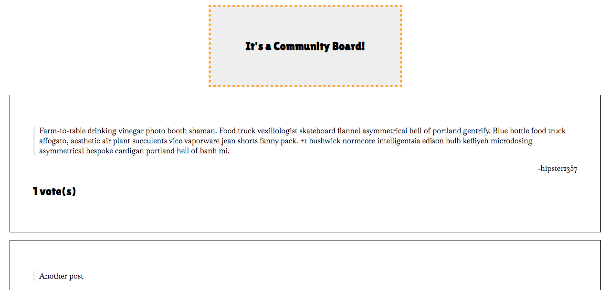

# Lab: Online Community Forum with Firestore



## The Goal

In this lab, you'll build a community forum where users can make text-based posts which can then be upvoted or downvoted.

## The Setup

1. Clone this repository using `git clone`
2. `cd` into the project folder
3. `npm install`
4. `npm start`

## The Lab

### Part One: Initialize Firebase and Firestore

1. If you haven't already, sign up for Firebase and follow the initial setup instructions.
   1. Run `npm install firebase` in your development environment.
   2. Sign up for a Firebase account.
   3. Add a new Firebase project
   4. Integrate Firebase into your React app by making a `Firestore.js` Component.
   5. Set up a new database and collection called `community-board` in Firestore
> Note: consult the "Setting Up Firestore" section from the lesson notes.

2. Input the data below to add an initial post to your `community-board` collection. This will be the basic structure of each post on the community board, but feel free to expand upon it with additional fields if you'd like.

```javascript
// DocumentID is 1
1: {
    "user":"hipster2357",
    "post":"Farm-to-table drinking vinegar photo booth shaman. Food truck vexillologist skateboard flannel asymmetrical hell of portland gentrify. Blue bottle food truck affogato, aesthetic air plant succulents vice vaporware jean shorts fanny pack. +1 bushwick normcore intelligentsia edison bulb keffiyeh microdosing asymmetrical bespoke cardigan portland hell of banh mi.",
    "voteCount":0
}
```
Source: [hipster ipsum](https://hipsum.co/)

3. Add 3 additional post documents to your collection using the structure above.

> Note: make sure to set the "voteCount" variable type to `number`; the others can be kept as `string` (which is the default).

### Part Two: Reading from Firestore

1. Replace the current message in `App.js` with the `<Post />` Component, and include any necessary `import` statements.
2. Complete the `<Post />` component in `./Components/Post.js` to:
    1. Connect to your database.
    2. Indicate the collection and doc to retrieve. For now, retrieve the doc with `{'id':1}`.
3. Update the `<Post />` component to receive the post `id` via a prop.
> Note: Firestore expects the documentID to be a string; if you pass the prop as a number, consider using the `.toString()` method to convert the number to a string.

#### Part Two: Stretch

4. Add a function to `App.js` that uses `.map()` to efficiently show all 4 posts in the database. For example:

```javascript
let posts = [1,2,3,4].map((value) => {
   let postID = value.toString();
   return <Post postID={postID} />
});
```
5. Rewrite the function to [get all posts in the Firestore database](https://firebase.google.com/docs/firestore/query-data/get-data#get_all_documents_in_a_collection) and generate a `<Post />` for each document.
6. Update your function to show posts in reverse chronological order so the newest post is at the top of the list and the oldest is at the bottom.

### Part Three: Writing to Firestore

1. Add a new Component called `<NewPost />` at the top of the forum which captures two pieces of information:
   1. A username
   2. The text of a post
> Note: Consult the "Firestore in React" section of the lesson notes for a pattern to follow.
2. Ensure that the `<NewPost/ >` component adds a new post to Firestore which:
   - Initially has a `voteCount` property equal to `0`
   - (stretch) Has an `id` that is in sequence with all previous posts. e.g. If the last post has `{'id':6}`, the new post should have `{'id':7}`.
3. Ensure that the Community Board is updated with any new post that is submitted.

- What other information would you want to capture from users? e.g. URLs? imageURLs? date? etc.

### Part Four: Updating in Firestore (Voting)

1. Add two new components to the `<Post />` Component:
   1. A component to `<Upvote />` which will add 1 vote to the total `VoteCount`.
   2. A component to `<Downvote />` which will subtract 1 vote from the total `VoteCount`.
> Note: Consider using HTML characters or emoji (see [Emojipedia](https://emojipedia.org/)) as symbols for users to click.
2. The components should update the value of `VoteCount` for that post both in Firestore and in the App (in state). The value on Firestore and the value in state should always be the same.
   